<!---
The page title should not go in the menu
-->

 User Guide 

# Quick Start

### 1. Open the IGV-Web app

In a [web browser](#supported-browsers), navigate to <https://igv.org/app>.   

!!! note " "
    Make sure that popups are not disabled in your web browser as some features rely on them. For example, loading tracks and genomes from files in Google Cloud Storage may pop up a login window. Also note that some options may not be available if all cookies have been disabled in the web browser preferences. 

### 2. Load a reference genome
IGV requires a reference genome. It serves as the "coordinate system" for displaying the tracks. When the IGV-Web page first loads, it will load a default reference genome. To load a different genome, you can either select one of IGV's predefined genomes or use one of the options to load a genome sequence file that you specify, as described in the section on [loading the reference genome](#loading-the-reference-genome) below.

!!! note " "
    You must first load the reference genome, before loading data tracks. Switching genomes will clear out any loaded tracks.

### 3. Load data tracks

Load one or more data tracks by either selecting a predefined track or loading a genomic data file, as described in the section on [loading data tracks](#loading-data-tracks) below.

### 4. Navigate

IGV-Web provides several navigation controls for specifying the genomic region to view, as described in the section on [navigating the view](#navigating-the-view) below.

# Loading the reference genome

IGV requires a reference genome. It serves as the "coordinate system" for displaying the tracks. When the IGV-Web page first loads, it will load a default reference genome. To load a different genome, you can either select one of IGV's predefined genomes or use one of the options to load a genome sequence file that you specify.

!!! note " "
    You must first load the reference genome, before loading data tracks. Switching genomes will clear out any loaded tracks.

#### **Predefined genome**

The available predefined genomes are listed in the `Genome` dropdown menu. If you select any of these genomes, a corresponding gene annotation track will also be loaded.

The menu includes the complete list of available predefined genomes. In order to more easily find the genomes you use most often, the most recently-used ones (up to 5) are displayed above the predefined genomes list (only if third party cookies are enabled in your web browser).

#### **Genome files**

If you have your reference genome in a GenBank (.gbk) file, FASTA file, or a [twoBit file](https://genome.ucsc.edu/FAQ/FAQformat.html#format7), you can load it using one of the options in the top part of the `Genome` menu: 

* `Local File`
* `Dropbox`
* `URL`

You must have a [Dropbox](https://www.dropbox.com) account to use the `Dropbox` option.

Unless your FASTA file is quite small, it is recommended that you also load a corresponding index file. Loading a large FASTA file without an index is likely to freeze the app. The FASTA and index files must be specified at the same time. When loading via the `URL` option the dialog has entry fields for the web link URL to the file and to the corresponding index file. For the other loading options, both the FASTA file and the index file must be selected from the file chooser that pops up.

!!! note " "
    The FASTA and twoBit files only contain the the genome sequence and a corresponding genome annotation track will not be automatically loaded. You can load a genonme annotation file directly via the `Tracks` menu.

!!! tip " "
    **Advanced:** Another option is to create and load a .json genome file, which can include references to a cytoband file and a default gene annotation track. See the [File Formats section](./FileFormats.md) for details on the IGV reference genome JSON format.
    
#### **UCSC GenArk**

Reference genome assemblies and associated tracks can be loaded directly from the UCSC GenArk archive. Select `UCSC GenArk` from the `Genome` menu to display a table of all available assemblies. The table can be filtered by typing space separated terms in the search box. Click on the desired assembly and then OK. 

In addition to setting the reference genome, associated annotation tracks will also be loaded. In most cases, many tracks will be loaded. Any tracks you are not interested in can be deleted using its gear menu. To delete several tracks at once, click `Select Tracks` in the toolbar, and check the boxes to the left of the tracks to be deleted, then click on the gear menu for any one of them and select `Remove track`. These tracks can be reloaded from the `Tracks` menu, which contains all the tracks associated with the assembly in the GenArk archive.

For more information on the GenArk resource see
*Clawson, H., Lee, B.T., Raney, B.J. et al. GenArk: towards a million UCSC genome browsers. Genome Biol 24, 217 (2023).*
[https://doi.org/10.1186/s13059-023-03057-x](https://doi.org/10.1186/s13059-023-03057-x)

!!! tip " "
    Track hub support is not limited to the GenArk site, but includes any hub in the `useOneFile` format (see the documentation on [track hub settings](https://genome.ucsc.edu/goldenPath/help/hgTracksHelp.html#UseOneFile) at the UCSC site). Select the `URL` option in the `Genome` menu to load the URL to a hub.txt file at a UCSC hub.

# Loading data tracks

To load data and genomic annotations, click on the `Tracks` dropdown menu and either select from the selection of predefined tracks or choose one of the options to load files that you specify.

#### **Predefined track**

Categories of available predefined tracks are listed in the menu. Clicking on a category will open a list of datasets. For example, if `ENCODE` is one of the menu items, clicking on it will bring up a list of datasets available from the ENCODE data portal (Encyclopedia of DNA Elements, <https://www.encodeproject.org>). 

!!! tip " "
    The set of predefined tracks presented in the menu varies depending on the current reference genome. Some genomes do not come with any predefined tracks. 

#### **Track file**

To load track data from a file, use one of the options in the top part of the menu: 

* `Local File`
* `Dropbox`
* `URL`

Selecting the `URL` option will present a dialog where you enter the full web link URL to one data file and the corresponding index file, if there is one. For the other options, a file chooser pops up and you can select files for multiple tracks, along with the corresponding index files.  You will need a [Dropbox](https://www.dropbox.com) account to use the `Dropbox` option. 

For indexed files, e.g. BAM files, you must explicitly select the index file along with the data file. If you also use IGV-Desktop, you may be used to IGV automatically finding and loading the index file. This is not always possible from a web browser, so the behavior is different in IGV-Web.

The [File Formats section](./FileFormats.md) has information about supported file types.

!!! note " "
    Make sure to load only data files that correspond to the current reference genome. In general, a genomic data file does not include information about the genome it aligns to, which means IGV cannot automatically check if they match.

# Special tracks

### Sequence track

When zoomed in sufficiently, the reference genome sequence track appears just below the chromosome ruler. Depending on the zoom level, the sequence is represented by colored bars: 
 
or colored letters: 

with adenine (A) in green, cytosine (C) in blue, guanine (G) in yellow, and thymine (T) in red.

The gear menu for sequence tracks includes two options:

* **Strand direction.** Initially, the forward / positive strand is displayed. Click on `Reverse` to flip to the reverse / negative strand. Click on `Forward` to change it back.

* **Sequence translation.** Click on `Three-frame Translate` to display a 3-band track that shows a 3-frame translation of the amino acid sequence for the corresponding nucleotide sequence. The translation is shown for the current strand. Amino acids are displayed as blocks colored in alternating shades of gray. Methionines are colored green, and all stop codons are colored red. When you zoom all the way in, the amino acid symbols will appear. Click on `Close Translation` to collapse the track to display the sequence only.
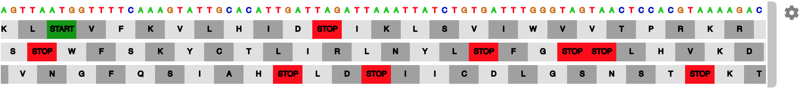

The sequence track cannot be removed, but it can be moved to a different position by click-dragging the track handle on the right, just like any other track.

### Genome annotation track

If you load a reference genome from the list of hosted genomes provided in the `Genome` menu, a special genome annotation track is also automatically loaded. For most of the hosted genomes, these annotations are from NCBI's Reference Sequence Database (RefSeq). This track will be automatically unloaded if you select a different reference genome.

When you load a data track, it will be positioned just above this genome annotation track. So by default, the annotations for the reference genome are always displayed at the bottom. You can however move the annotation track at any time by dragging it to a different position, just like any other track. 

By default, the annotations are displayed in a compact mode, where overlapping transcripts are collapsed into a single line:
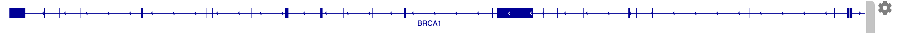
The track gear menu provides two different options for expanding the display to show the overlapping features on separate lines: 
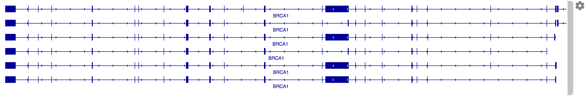
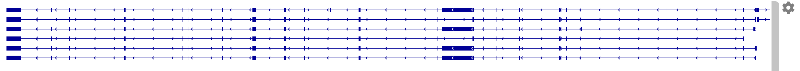

!!! tip " "
    Changing the display mode does not affect the track height. A scrollbar will be added to the track if it is too short to display all the lines. To increase or decrease the track height, select `Set track height` from the gear menu.  

# Navigating the view

IGV-Web provides several navigation controls for specifying the genomic region to view. A ruler indicating the extent of the current region is displayed below the toolbar, and the size of the region and its genomic coordinates are displayed in the toolbar.

#### **Select a chromosome**
The chromosome dropdown menu in the toolbar includes an entry for every chromosome or contig in the current reference genome. Selecting a chromosome from the menu will set the view to include the whole chromosome. The ruler also includes a cytoband ideogram if you selected one of the predefined reference genomes.
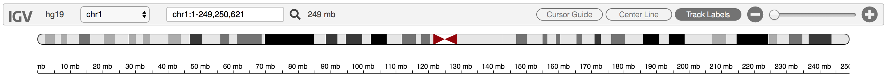

#### **Select chromosome "all"**
At the top of the list of chromosomes in the dropdown menu there is also the special entry `all` to view the whole genome, with all the chromosomes laid out side-by-side. Or you can enter `all` in the text box where the genomic coordinates are displayed.
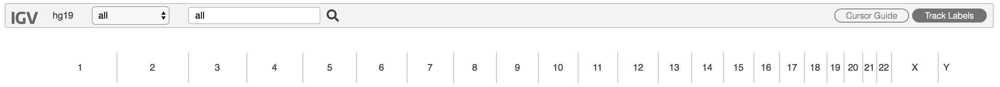   

* Clicking on a chromosome in the whole-genome ruler will set the view to that chromosome, just like selecting the chromosome from the dropdown menu.

#### **Enter genomic coordinates**
In the text box where the genomic coordinates are displayed, you can type the coordinates of the region you want to view (e.g. *chr17:41,195,312-41,278,500*). The thousands separator is optional, but the chromosome name is required. 

#### **Search by gene name**
In the text box where the genomic coordinates are displayed, type the name of a gene (e.g. *BRCA1*) and hit return or click on the magnifying glass. IGV will look up the genomic coordinates for that gene and set the viewing region accordingly. *Currently supported for human and mouse genomes only.*

#### **Enter multiple loci**
In the text box, you can enter multiple regions by gene name, genomic coordinates, or a mixture of the two, separated by spaces (e.g. *BRCA1 BRCA2 KRAS*). This will split up the IGV view into multiple panels and display the regions side-by-side, each with its own ruler. 
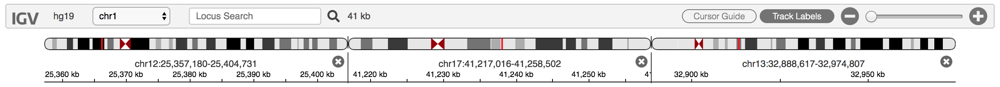   

* Clicking on the genomic coordinates above the ruler of any of the panels will change the view to only that region.

* Close a panel by clicking on the **X** on the right edge of its ruler. 
	
#### **Zoom and pan**
 
* Use the zoom slider or the **+** and **-** buttons on the right end of the toolbar to zoom in and out. In multi-locus view, this will affect all the panels. *The zoom controls are not available in whole-genome view*. **Note:** If your browser window is narrow, the **+** and **-** buttons appear without the slider widget.
	 
* Double-click in any of the data tracks to zoom in one level. The new view will be centered on the point where you clicked.
	
* Click and drag in the ruler to sweep out a region to zoom into.
	
* Click on the cytoband ideogram to move the view to that locus without changing the zoom level.
	
* In any of the data tracks, click and drag (left or right) to pan the view across the genome. 

#### **Jump to next/previous feature**
To navigate between features in a feature track (e.g. the reference genome annotation track, BED track, GFF3 track, etc.), first select the track by clicking on `Select Tracks` in the toolbar and then clicking in the checkbox to the left of the desired track. Then press either `f` or `F` to jump forward to the next feature; or `b` or `B` to jump backward to the previous feature. The upper case versions will also zoom in to the feature; the lower case versions will not change affect the zoom level.

# More about tracks

### Track attributes: gear menu
Clicking on a track's gear menu reveals a number of attributes. The set of attributes is determined by the type of file that was loaded into the track. For example, for a track displaying paired-end sequence alignments from a BAM file, the menu includes an option `View as pairs`. In addition to `Remove track`, all tracks will include the menu items `Set track name` and `Set track height`.

#### **Setting attributes on multiple tracks**
Clicking on the `Select Tracks` button in the toolbar displays checkboxes to the left of all the tracks. To set attributes for multiple tracks at once, select the tracks of interest by clicking in their checkboxes. The gear menus for those tracks will then contain only the attributes that can be applied to all of the selected tracks. For example, selecting `Set track color` in the gear menu of any of the selected tracks will set the color for all of them.

If you select multiple quantitative data tracks, you will see a new item `Group autoscale` in their gear menus, in addition to the `Autoscale` item that is always there for quantitative data tracks. 

* Autoscaling a single track will dynamically change the data range (Y-axis) of the track as you pan across the genome to maximize the display given the data currently in view and the track's height. 
* Group autoscaling will keep the data range of multiple tracks dynamically in sync.

### Track actions: popup menu
Right-clicking on a data track brings up a popup menu with actions you can perform. The set of menu items is determined by the type of file that was loaded into the track. For example, for a track displaying copy number data from a multi-sample SEG file, the menu includes an option `Sort by value`, which sorts the samples by copy number value at the locus where you clicked on the track. The sort order is toggled on each selection.

### Displaying track data details

Clicking on a data element in a track will display details about the element in a separate popup window. The type of details displayed depend on the track type. 

By default, when you click on the next data element, the previous popup will close. Use `Shift+click` to open multiple information popups.

### Moving and deleting tracks
When you load a track it will be added to the bottom of the IGV track panel. To change the track order, just click on the gray grab-bar on the right edge of the track and drag it up or down to the new location.

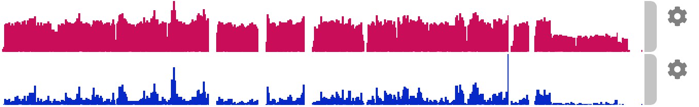{height=100}

To remove a track from the IGV browser, click on the gear icon to the right of the track and select `Remove track` from the menu that pops up. 

!!! note " "
    Removing a track does not just hide the track. If you want to show it again you must reload the data file.  

Loading a new reference genome will also delete all loaded data tracks. Refreshing the IGV-Web page in the browser will delete all loaded data and reset to the default reference genome. Or, if you launched IGV-Web from a shared URL or browser bookmark, refreshing the page will go back to the initial session state defined by the URL or bookmark. 

### Overlaying tracks

Quantitative data tracks can be combined so they are displayed together as overlaid charts in a single track. 

For example, the following two tracks:

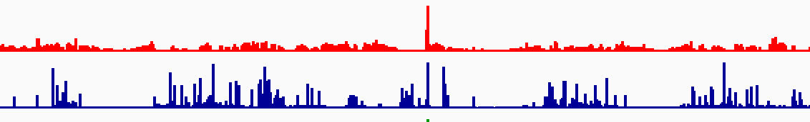{width=600}

can be displayed as the following single track by multi-selecting the two tracks and then clicking on the `Overlay Tracks` button in the toolbar. 

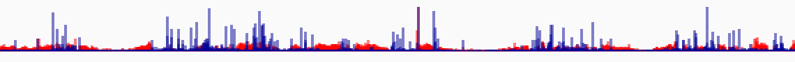{width=600}

!!! tip " "
    To multi-select the tracks, first click on the `Select Tracks` button in the toolbar to display selection checkboxes to the left of all tracks, and then select the two tracks you want to overlay. 

Each chart is drawn with a default level of translucence so they don't completely obscure one another. Select `Set transparency` from the combined track's gear menu to make the charts more or less opaque.

To separate the charts into the original tracks, select `Separate tracks` from the combined track's gear menu.

!!! note " "
    You may want to set the data ranges to be the same on the tracks before overlaying them or you can enable autoscale in the gear menu of the combined overlay track to keep the data ranges of the constituent tracks in sync.

# Sample attributes

For some multi-sample track types, such as segmented copy number (SEG files) and variant calls (VCF files), you can associated sample attributes with a track and use them for sorting the samples. 

* **To load and display sample attributes**, use the `Sample Info` menu to load a [sample attribute file](../FileFormats/#sample-info-attributes). 

The attributes are displayed as a matrix of colored blocks, where each column represents an attribute, and a row of blocks represents all the attribute values for a single sample. In IGV-Web the attribute matrix is displayed to the right of the track data and to the left of the track scroll bar (if there is one) and the track's gray grab bar.

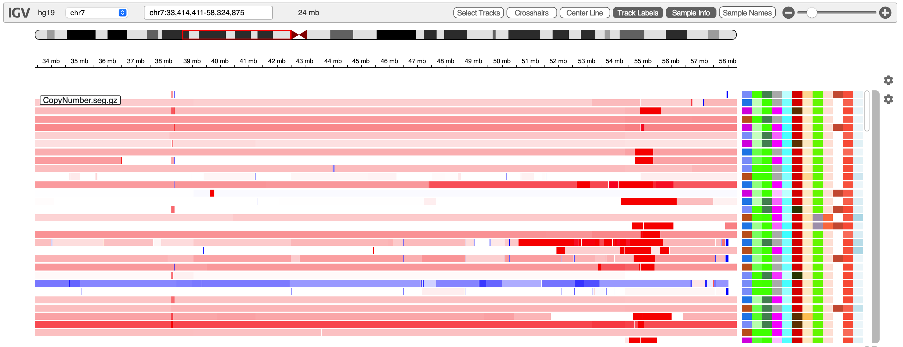

If two samples have the same color block for a particular attribute, both samples have the same value for that attribute. However, the colors are arbitrary and different sessions of IGV may not use the same colors.

* Hover over any block in a column to **display the attribute name**.

* Hover over a colored block to **display the attribute value** for a sample.
        
* Click in the gear menu and select one of the attribute names under `Sort by attribute:` to **sort the samples based on that attribute**.

* Click on the `Sample Info` button to **hide or show the sample attribute matrix**.

**Examples:** The [Example Sessions section](../ExampleSessions) has links two live IGV-Web app sessions that demonstrate sample attributes, one with VCF data and one with SEG data.

# Saving sessions
IGV-Web has a number of options for saving the state of your IGV session: you can save a file in IGV session format, bookmark the page in your browser, or create a web link URL that you can share with others. 

Be aware that the saved state of an IGV session includes pointers to the data files for any loaded tracks. So to fully restore the state, you must have access to the same files that were loaded when the IGV session was saved.

!!! note " "
    Due to security restrictions on web browsers, IGV-Web cannot automatically load files from the local file system. If you save an IGV session that includes tracks or a reference genome that were loaded from local files, they cannot be loaded when you restore the session **even if you run the session in the same environment on the same computer** where you saved the session. 

### Session files
To **save** a file that contains the state of the current IGV session, click on the `Session` dropdown menu, select `Save`, and enter a filename into the dialog that pops up. The filename must have the .json suffix, or it will not be recognized as a session file when later loaded into IGV-Web. Depending on your web browser settings, the file will be saved to your default downloads folder or you will be prompted to specify a destination folder. 

You can share your session with others, for example by emailing it to them, or copying the saved file to a shared file system, or uploading it to Dropbox, or a web server.

To **restore** a session from a saved file, click on the `Session` dropdown menu and select one of the options in the top part of the menu: 

* `Local File`
* `Dropbox`
* `URL`

Selecting the `URL` option will present a dialog to enter the full web link URL to the session file. For the other options, a file chooser pops up. You must have a [Dropbox](https://www.dropbox.com) account to use the `Dropbox` option. 

#### Session files from IGV-Desktop
Session files that were saved in the Java desktop version of IGV can also be loaded into IGV-Web via the `Session` dropdown menu. However, IGV-Desktop supports more features and file types than the IGV-Web app, and so the session may not be completely restored. Also note that session files saved in IGV-Web currently cannot be loaded into IGV-Desktop.

### Bookmarks
To bookmark the current state of the IGV page in your web browser, first click on `Bookmark` in the IGV-Web menu bar. This will update the URL in the web browser's address bar. Then you can use your browser to save a bookmark for the page (in most web browsers use `Command+D` on MacOS, `Ctrl+D` on Windows). 

To restore a bookmarked session, use your browser's mechanism for going back to a bookmarked page.

### Shareable links
To create a web link URL that will open the IGV-Web app with all the same data tracks and settings as the current session, click on `Share` in the menu bar. A dialog will pop up and display a short URL that encodes the current state of the IGV session.

* Use the `COPY` button to copy the URL to the clipboard and paste it wherever you want for safe keeping. 
* Alternatively, the `Tweet` and `EMAIL` buttons provide shortcuts for sending the URL to others. 
* The `EMBED` button generates an HTML code snippet that can be used to add the session to a web page. 
* The `QR CODE` button generates a QR two-dimensional barcode for the URL.

To restore a session from a URL, paste it into a browser address bar, or click on the URL in an email message, tweet, etc.

# Saving images

You can save an image of all the tracks as displayed in the IGV view or a single track. 

* To save an image of **all the tracks** currently displayed, as well as the ruler and cytoband ideogram, click on the `Save Image` menu and select either `Save as PNG` or `Save as SVG`.

* To save the image of an **individual track**, right-click on the track to bring up the *popup menu* and select either PNG or SVG format.

Depending on your web browser settings, the image files will be saved to your default downloads folder or you will be prompted to specify a destination folder. 

# Miscellaneous tools

## BLAT

*(Introduced in IGV-Web version 1.13.0)* 

IGV-Web supports [BLAT](http://en.wikipedia.org/wiki/BLAT_%28bioinformatics%29) (*BLAST-like Alignment Tool*) 
for on-the-fly alignment of query sequences from reads in alignment tracks. 

* Right-click on a read of interest in an alignment track (BAM or CRAM), and select `BLAT read sequence` from the popup menu. 
* If soft clips are displayed and are of sufficient length, the popup menu will also include options to BLAT the soft-clipped sequence. 

The sequence query is sent to an external BLAT search engine hosted at 
the [UCSC Genome Browser](https://genome.ucsc.edu/cgi-bin/hgBlat). UCSC's BLAT search supports most UCSC
derived genomes including human and mouse genomes. 

The results of a BLAT search are presented in two different ways:

* As a new **feature track** in the lower panel of IGV's display, where each feature in the track represents a hit; and
* As a **results table** that is displayed in a separate popup window. If you close the table window, you can open it again by selecting `Open table view` from the gear menu of the corresponding results feature track.

If you select a row in the results table and click on the `Go To` button, the IGV browser will change the view to that region. Selecting multiple rows will set the view to a multi-locus view of all selected regions side by side.
 
## Regions of interest

*(First version introduced in IGV-Web version 1.12.9)*

You can identify one or more genomic regions as special _Regions of Interest_ (ROI). 

* To **create** a region of interest, hold down the Shift key and sweep out the region in the genome ruler. (Note: without the Shift key, sweeping out a region in the ruler will zoom in to that region). 

Regions of interest are visually indicated by a green bar below the ruler and a light gray area across all tracks, as shown in the screenshot below.

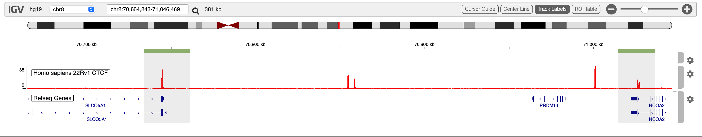

* Click in a region's green bar to bring up a **menu** with actions that can be applied to the region:

    * To provide a **label or description** for the region of interest, select `Set description...` from the menu and then enter the description.
    
    * To **copy** the reference genome nucleotide sequence in that region to the system clipboard, select `Copy reference sequence` from the menu. This menu item will only appear if the region is 1 Mb or less.
    
    * To **BLAT** the reference genome nucleotide sequence in that region, select `BLAT reference sequence` from the menu. This menu item will only appear if the region is 25 kb or less.
  
    * To **delete** the region of interest, select `Delete` from the menu.

* Click on the `ROI Table` button in the toolbar to display a **table summary of all regions**.  The table supports the following actions:

    * If you select a row in the table and click on the `Go to selected region(s)` button, the IGV browser will change the view to that region. Selecting multiple rows will set the view to a multi-locus view of all selected regions side by side.
    
    * To disable the gray highlighting across all tracks, click on the `Hide all ROIs` button. To reenable the highlighting, click on the same button again. Note that the green bar below the ruler is always displayed.
    
    * For regions of 1 Mb or less, you can select its row in the table and click on the `Copy sequence` button to copy the nucleotide sequence in that region to the system clipboard.

## Circular view
*(Introduced in IGV-Web version 1.9.0)* 

In collaboration with the JBrowse development team, we integrated the JBrowse 2 circular view component for exploring structural variants, chromatin interactions, and other long-distance interactions. Currently this integration supports structural variants from VCF files, paired-end and split-read alignments from BAM/CRAM files, and interaction pairs from bedPE and interact tracks. See [here](https://github.com/igvteam/igv-webapp/wiki/Circular-View) for more information about using the circular view with IGV-Web. The circular view will not be available if the web browser preferences have been set to disable all cookies.

# Help menu

The `Help` dropdown menu provides links to:

* The landing page of this online documentation (https://igv.org/doc/webapp)
* The **Example Sessions** section of this online documentation.
* The IGV **user forum**, where you can post support questions, bug reports, feature requests and other suggestions.
* The **GitHub repository** that hosts the IGV-Web source code. It provides another means of reaching the IGV team for support (via Git issues), and it includes documentation on how to host a local installation of the IGV-Web app.
* IGV-Web version information.
* IGV privacy policy.

# Supported browsers

IGV-Web requires a modern web browser with support for JavaScript ECMAScript 2015. We try to test on the latest versions of Chrome, Safari, Firefox, and Edge. The Internet Explorer (IE) browser is not supported.

http://127.0.0.1:8000/images/RegionsOfInterest.png